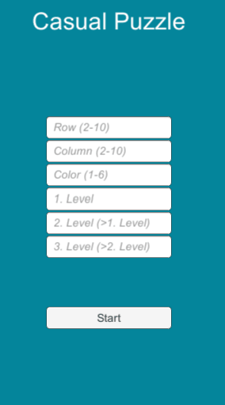
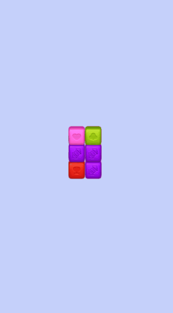

# Puzzle-Game-Clone

- An implementation of Collapse / Blast mechanic
Collapse / Blast mechanic is a type of tile matching game mechanic. In these games the player is expected to find groups of the same colored blocks and by tapping/clicking on these groups the player removes those blocks from the board. The vacant cells will then be filled with the stacked blocks above and newly created blocks as well.
- Deep First Search was used to find blocks of the same color.
- Designed with Strategy Pattern for easy addition of new block colors

